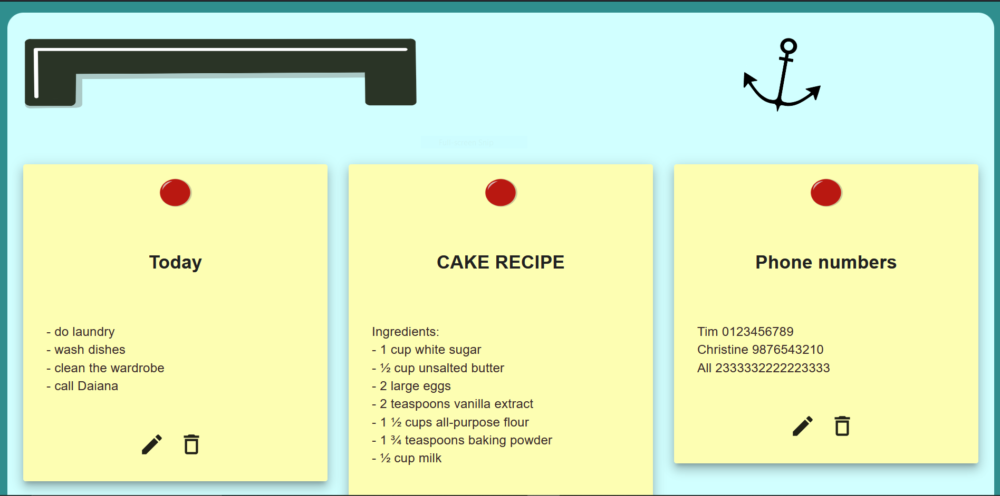

# Fridge Notes App

Keeping your notes made easier with this React.js app. 
Using LocalStorage, React MUI and well designed images and stickers, looks and accesibility combine to make an user-friendly app.

Image of the button section of the page

Image of the note display part of the page

**User guide**: 
- The app has an eye-catching design resembling a nostalgic vintage fridge on which you stick your paper notes.
- The user has an about section which explains the purpose of the app.
- Each note is stored using LocalStorage, so the notes are kept between sessions.
- A note has a title and a text.
- A note can be created, edited in place and deleted.
- A note cannot be deleted until a warning box is showed and the user confirms it. 
- Each note has an intuitive design with buttons for deleting and editing.
  
## Live App
https://sdrann.github.io/fridge-notes-app/
